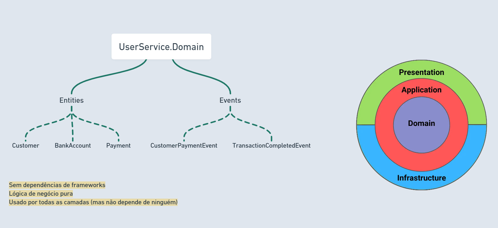
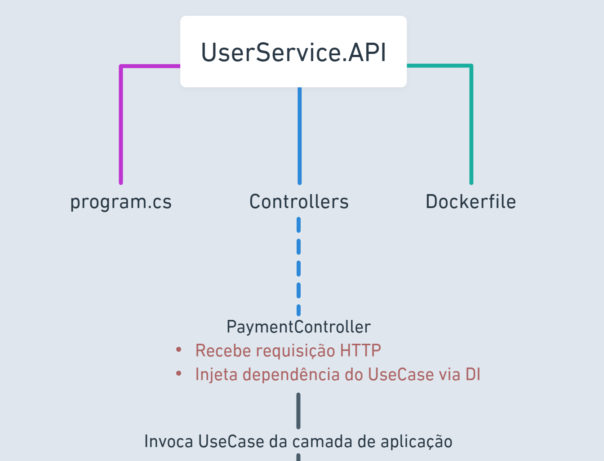
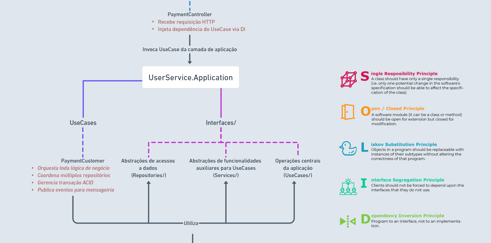
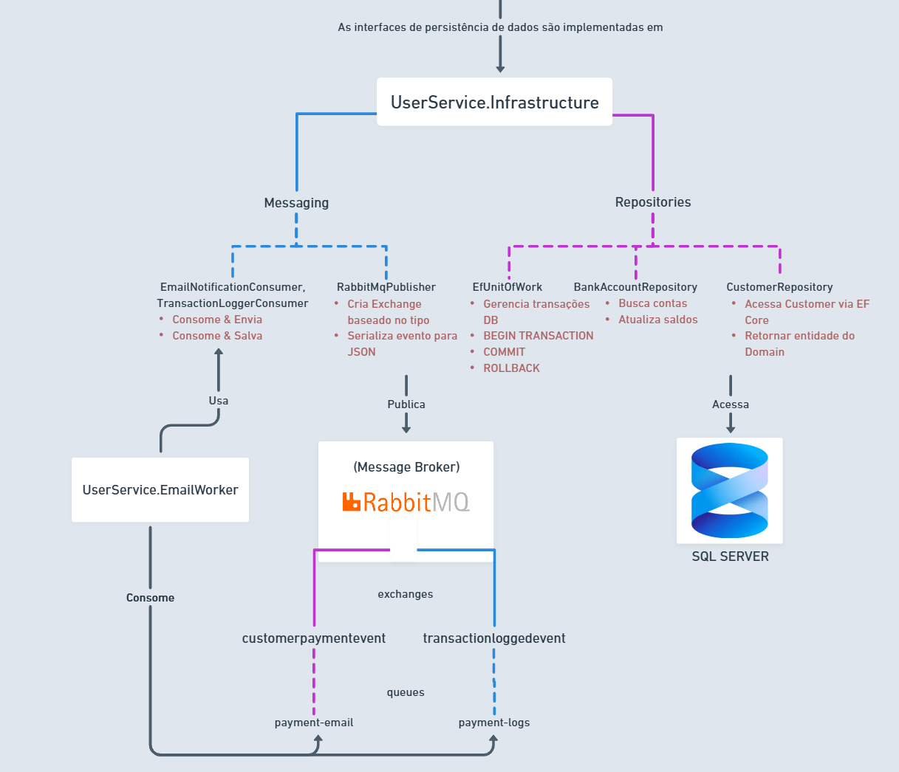

# Sistema de Pagamentos com RabbitMQ

## Descrição

Sistema de pagamentos construído com **Clean Architecture** e **Event-Driven Architecture** utilizando RabbitMQ para mensageria assíncrona. Este projeto foi desenvolvido para praticar os princípios de Clean Architecture, SOLID e padrões de comunicação orientada a eventos.

O sistema processa transações financeiras entre usuários e publica eventos de domínio que são consumidos assincronamente por workers para notificações por email e registro de auditoria.
### Funcionalidades Principais

- **Processamento de Pagamentos**: Transferência de fundos entre contas de usuários com transações ACID
- **Arquitetura Orientada a Eventos**: Publicação de eventos via RabbitMQ para processamento desacoplado
- **Notificações por Email**: Serviço assíncrono de email para confirmações de transações
- **Log de Auditoria**: Histórico de transações para conformidade e rastreamento
- **Clean Architecture**: Separação clara de responsabilidades entre camadas
- **Princípios SOLID**: Base de código manutenível e testável
- **Docker Compose**: Serviços containerizados para fácil implantação
## Arquitetura
> Algumas interfaces e métodos foram omitidos para simplificar a visualização e destacar apenas os principais componentes e suas interações.


<div align="center">
  
  <br><br>
  
  <br><br>
  
  <br><br>
  
</div>


## Tecnologias Utilizadas

- .NET 8 - Framework
- SQL Server Management Studio 21 - Banco de dados
- RabbitMQ - Message Broker
- Entity Framework Core - ORM
- Docker & Docker Compose - Containerização
- MailTrap - Serviço de testes de email
- AutoMapper - Mapeamento de objetos 

##  Pré-requisitos
- Docker Desktop instalado e em execução
- .NET 8 SDK (apenas para desenvolvimento)
- Git
- Conta gratuita no [MailTrap](https://mailtrap.io) - Para obter credenciais SMTP de teste

##  Como Usar
### 1. Clone o Repositório
```bash
git clone https://github.com/PauloAnjos22/DemoRabbitMq
cd DemoRabbitMq
```

### 2. Configure as Variáveis de Ambiente

Crie um arquivo `.env` na raiz do projeto com as seguintes variáveis:

```env
MSSQL_SA_PASSWORD=StrongPassword123!
MAILTRAP_USER=seu_usuario_mailtrap
MAILTRAP_PASS=sua_senha_mailtrap
```

### 3. Suba os Containers com Docker

```bash
docker-compose up --build
```

**Observação**: Acompanhe a execução dos containers via Docker Desktop! O correto seria usar um tipo de timeout para os serviço da API e worker esperarem o banco e o rabbitmq estar prontos. (Minhas tentativas iniciais falharam, e no fim acabei não tocando mais nisso! :D) :
- SQL Server: `localhost:1433`
- RabbitMQ: `localhost:5672` (Management UI: `http://localhost:15672`)
- UserService API: `http://localhost:8080`
- Email Worker: rodando em background

### 4. Teste o Sistema

#### 4.1. Criar Dois Clientes

**Cliente 1:**
```bash
POST {{UserService.API_HostAddress}}/api/customer
Content-Type: application/json

{
    "Name": "João Silva",
    "Email": "joao@email.com"
}

```

**Cliente 2:**
```bash
POST {{UserService.API_HostAddress}}/api/customer
Content-Type: application/json

{
    "Name": "Maria Santos",
    "Email": "maria@email.com"
}

```
Utilize as rotas GET para obter informações sobre ID ou contas bancárias dos clientes

#### 4.2. Adicionar Fundos à Conta
```bash
POST {{UserService.API_HostAddress}}/api/payment/add-funds
Content-Type: application/json

{
  "CustomerId": "COLE_O_ID_DO_CLIENTE_1_AQUI",
  "Amount": 5000
}
```

#### 4.3. Realizar um Pagamento

```bash
POST {{UserService.API_HostAddress}}/api/payment/new-payment
Content-Type: application/json

{
    "From": "ID_DO_CLIENTE_1",
    "To": "ID_DO_CLIENTE_2",
    "Amount": 1800,
    "Method": "CreditCard"
}
```
### 5. Acompanhar os Eventos

#### Opção 1: Via Docker Logs
Eu particularmente prefiro acompanhar pela GUI do Docker Desktop!

```bash
# Ver logs do Email Worker
docker logs -f email-worker-container

# Ver logs da API
docker logs -f userservice-container
```

#### Opção 2: Via MailTrap
1. Acesse [MailTrap](https://mailtrap.io)
2. Vá para **My Inbox**
3. Veja os emails de confirmação de pagamento